# 🧪 SentroniX: Consolidated Master Test Plan, System Verification & Quality Assurance Report
## Comprehensive Multi-Phase Testing Master Suite: Versions 1.0, 2.0 & 3.0 PRO

---

| **Document Attribute** | **Specification** |
| :--- | :--- |
| **Document ID** | `STX-TP-CONSOLIDATED-V1-V2-V3-FINAL` |
| **Project Name** | **SentroniX** — Autonomous Purple Team & AI DevSecOps Ecosystem |
| **Software Versions Covered** | Version 1.0 (Foundation), Version 2.0 (Purple AI), Version 3.0 PRO (Active Defense) |
| **Total Verified Test Cases** | **67 Formal Test Cases (35 in V1.0, 16 in V2.0, 16 in V3.0 PRO)** |
| **Testing Scope** | Unit, Integration, Functional Positive, Adversarial Negative, Browser Automation, Defect Post-Mortems |
| **Project Leads & QA Engineers** | **Keval Doshi** (Lead Architect & QA) & **Aaryan Thummar** (Co-Lead & QA) |
| **Course / Level** | Software Project Management (SPM) / Final Year Project, B.Sc. IT |
| **Verification Status** | **100% Tests Passed (67/67 Cases) \| 0 Unresolved Critical Bugs \| Certified Enterprise Ready** |
| **Production Host** | [https://sentronix.onrender.com](https://sentronix.onrender.com) |

---

## 📑 Table of Contents
1. [Master Quality Assurance & Testing Framework](#1-master-quality-assurance--testing-framework)
2. [PART I: Version 1.0 — Foundational Architecture & Core Verification (35 Tests)](#2-part-i-version-10--foundational-architecture--core-verification)
   - [2.1 V1 Positive Functional Scenarios (15 Tests)](#21-v1-positive-functional-scenarios)
   - [2.2 V1 Negative & Error Boundary Tests (12 Tests)](#22-v1-negative--error-boundary-tests)
   - [2.3 V1 Automated Unit & Integration Tests (8 Tests)](#23-v1-automated-unit--integration-tests)
   - [2.4 V1 Visual Test Execution Screenshots](#24-v1-visual-test-execution-screenshots)
   - [2.5 V1 Defect Post-Mortem Log](#25-v1-defect-post-mortem-log)
3. [PART II: Version 2.0 — Purple Team AI Platform & Multi-Vector Verification (16 Tests)](#3-part-ii-version-20--purple-team-ai-platform--multi-vector-verification)
   - [3.1 V2 Positive Functional Matrix (With Screenshots)](#31-v2-positive-functional-matrix)
   - [3.2 V2 Negative & Adversarial Matrix](#32-v2-negative--adversarial-matrix)
   - [3.3 V2 Defect Post-Mortem Log (With Verified Visual Resolutions)](#33-v2-defect-post-mortem-log)
4. [PART III: Version 3.0 PRO — Autonomous Purple Team & Production Hardening (16 Tests)](#4-part-iii-version-30-pro--autonomous-purple-team--production-cloud-hardening)
   - [4.1 Full Platform Live Browser Audits (11 Modules)](#41-full-platform-live-browser-audits-11-modules)
   - [4.2 V3 Positive Functional Matrix](#42-v3-positive-functional-matrix)
   - [4.3 V3 Negative & Resilience Matrix](#43-v3-negative--resilience-matrix)
   - [4.4 V3 Deep-Dive Defect Post-Mortem Log (With Visual Evidence)](#44-v3-deep-dive-defect-post-mortem-log)
5. [PART IV: Final Quality Gate Certification & Sign-off](#5-part-iv-final-quality-gate-certification--sign-off)

---

## 1. Master Quality Assurance & Testing Framework

To certify enterprise reliability, adversarial resilience, and high-performance throughput, the SentroniX quality assurance methodology consolidates testing across all three engineering releases (V1.0 Foundation, V2.0 Purple AI, and V3.0 PRO Production). The strategy employs a 5-tier verification pyramid:

1. **Live Browser & UI Automation Testing:** Interactive end-to-end execution of all user journeys, capturing visual evidence of scan progress, threat grade calculations, sliding drawers, and interactive modal dialogs.
2. **Positive Functional Verification:** Validates that all system modules, REST endpoints, scanning jobs, AI patch generation, and extension link interceptors operate strictly according to design specifications under expected operational conditions.
3. **Negative & Adversarial Boundary Testing:** Evaluates platform resilience against malformed inputs, network dropouts, bypass attempts with disabled WAF rules, rate limiting, and unauthenticated fallback modes.
4. **Alpha & Beta Acceptance Testing:** Alpha developer integration testing for Celery worker concurrency and PostgreSQL/SQLite persistence; Beta user acceptance testing across Google Chrome, Microsoft Edge, Gmail, and Outlook Webmail.
5. **Detailed Defect Post-Mortem Analysis:** Technical root cause investigations for all encountered bugs, with step-by-step code resolutions, before-and-after screenshots, and regression prevention protocols.

---

## 2. PART I: Version 1.0 — Foundational Architecture & Core Verification

Version 1.0 established the containerized microservice foundation of SentroniX: Docker Compose orchestration, FastAPI asynchronous endpoints, regex-based malware threat scanning, LSB steganography analysis, Celery async queueing, and live telemetry polling. To ensure absolute foundational robustness, the Version 1.0 test suite was expanded to **35 comprehensive test cases**.

### 2.1 V1 Positive Functional Scenarios (15 Tests)
| Test ID | Module | Scenario & Injected Input | Expected System Behavior | Actual Output & Evidence | Status |
| :--- | :--- | :--- | :--- | :--- | :--- |
| **FT-01** | Malware Scanner | Upload standard EICAR anti-virus test string | Identifies exact signature; flags threat as `SUSPICIOUS` | Threat score 100%; EICAR pattern matched; HTTP 200 | **PASSED** |
| **FT-02** | Malware Scanner | Upload clean benign Python/JS script (`hello.py`) | Flags file as `CLEAN` with 0 detected threat vectors | Score 0.0%; Clean badge; Telemetry counter incremented | **PASSED** |
| **FT-03** | Malware Scanner | Upload obfuscated PHP webshell (`eval(base64_decode())`) | Pattern matcher detects shellcode execution functions | Flagged eval/base64 match; risk badge `CRITICAL` | **PASSED** |
| **FT-04** | Steg Analyzer | Upload standard clean baseline PNG image | Analyzes binary bitplanes; finds 0 concealed payloads | Shannon entropy 7.42; Bitplane variance clean | **PASSED** |
| **FT-05** | Steg Analyzer | Upload image with LSB-injected secret payload | Extracts payload bitstreams from Least Significant Bits | Extracted 1.2KB embedded payload; flagged anomaly | **PASSED** |
| **FT-06** | Worker Queue | Dispatch 5 asynchronous scan jobs to Celery | Redis queues tasks; Celery worker executes sequentially | All 5 jobs completed; states transitioned to `COMPLETED` | **PASSED** |
| **FT-07** | React Client | Navigate between Dashboard, Scans, and Files tabs | React SPA routes cleanly without page reloads | DOM re-rendered instantly; client state preserved | **PASSED** |
| **FT-08** | Telemetry Sync | Dashboard polls `/api/v1/dashboard/stats` | Backend queries DB; returns real-time JSON statistics | JSON stats payload returned in 24ms; UI counters sync | **PASSED** |
| **FT-09** | Orchestration | Execute `docker-compose up -d` on clean host | All 5 containers (db, redis, backend, worker, frontend) boot | Healthy status on all 5 containers via `docker ps` | **PASSED** |
| **FT-10** | DB Persistence | Verify scan findings stored in PostgreSQL | Creates findings row with foreign key to `scans.id` | Record inserted with `tenant_id`; persisted across reboots | **PASSED** |
| **FT-11** | Connection Pool | Simulate 50 concurrent DB reads/writes | SQLAlchemy connection pool manages active pool recycling | Zero leaked connections; pool recycled within `pool_size=10` | **PASSED** |
| **FT-12** | File Integrity | Upload sample binary and verify SHA-256 hash | Calculates SHA-256 hash; stores in scan audit log | Computed hash matched `sha256sum` verification utility | **PASSED** |
| **FT-13** | Threat Tagging | Evaluate findings across 4 severity tiers | Tags findings with `CRITICAL`, `HIGH`, `MEDIUM`, `LOW` badges | Correct color tokens rendered across findings drawer | **PASSED** |
| **FT-14** | File Upload UX | Drag-and-drop file into browser upload zone | Dropzone triggers visual hover effect & auto-submits | Dragover styling activated; progress bar displayed | **PASSED** |
| **FT-15** | System Health | Query `/health` endpoint on FastAPI backend | Returns HTTP 200 OK with database & worker status | JSON payload: `status='healthy'`, `db='connected'` | **PASSED** |

### 2.2 V1 Negative & Error Boundary Tests (12 Tests)
| Test ID | Component | Negative Injected Condition | Expected Defensive Handling | Actual Handled Output | Status |
| :--- | :--- | :--- | :--- | :--- | :--- |
| **NT-01** | Steg Analyzer | Upload non-image binary file (`malware.exe`) | Frontend restricts file dialog; Backend returns `HTTP 400` | Rejected with 'Unsupported media type: .exe'; HTTP 400 | **PASSED** |
| **NT-02** | Threat Scanner | Submit empty 0-byte file payload | Validation blocks upload; returns `HTTP 422 Unprocessable` | Caught zero-byte boundary; returned structured 422 error | **PASSED** |
| **NT-03** | File Stream | Upload excessively large file (>50MB payload) | FastAPI streaming middleware enforces `MAX_CONTENT_LENGTH` | Rejected at 50.1MB mark with `HTTP 413 Payload Too Large` | **PASSED** |
| **NT-04** | File Storage | Directory traversal filename (`../../etc/passwd`) | Sanitizes filename parameter to prevent host escape | Stored as sanitized filename 'passwd'; no traversal | **PASSED** |
| **NT-05** | Database | Hard-stop PostgreSQL container during active poll | API catches connection drop; returns structured 500 | Returns JSON error 'Database unavailable'; server stays up | **PASSED** |
| **NT-06** | Worker Queue | Terminate Redis broker during queued scan | Celery worker catches disconnect; reconnects with backoff | Worker logged broker loss; reconnected upon Redis boot | **PASSED** |
| **NT-07** | API Gateway | CORS request from unauthorized malicious origin | FastAPI CORS middleware rejects non-whitelisted origin | Blocked by CORS policy; `Access-Control-Allow-Origin` omitted | **PASSED** |
| **NT-08** | File Upload | Upload file with embedded null bytes (`%00.php`) | Regex filename sanitizer strips null bytes safely | Null byte stripped; saved as benign alphanumeric name | **PASSED** |
| **NT-09** | API Gateway | Burst 100 requests in 5 seconds (Rate Limit Test) | Rate-limiting middleware throttles excess client requests | First 30 accepted; remaining 70 received `HTTP 429` | **PASSED** |
| **NT-10** | Steg Analyzer | Upload corrupted header image file (truncated PNG) | Pillow image parser catches IOError; logs clean warning | Caught `UnidentifiedImageError`; returned HTTP 422 cleanly | **PASSED** |
| **NT-11** | Backend API | Submit malformed JSON payload (missing closing brace) | Pydantic validator catches syntax error before handler | `HTTP 422 Unprocessable Entity` with exact error offset | **PASSED** |
| **NT-12** | File Streaming | Client aborts connection during 20MB file upload | FastAPI closes file stream handle; cleans temporary buffer | Temporary buffer unlinked; zero file descriptor leak | **PASSED** |

### 2.3 V1 Automated Unit & Integration Tests (8 Tests)
| Test ID | Test Function & Fixture | Module Tested | Assertion & Verification Rule | Status |
| :--- | :--- | :--- | :--- | :--- |
| **UT-01** | `test_eicar_signature_matcher()` | `malware_scanner.py` | `assert scan_string(EICAR).threat_score == 1.0` | **PASSED** |
| **UT-02** | `test_shannon_entropy_calculation()` | `steg_analyzer.py` | `assert compute_entropy(uniform_bytes) >= 7.95` | **PASSED** |
| **UT-03** | `test_jwt_token_claims_and_expiry()` | `auth.py` | `assert decode_jwt(token)['sub'] == test_email` | **PASSED** |
| **UT-04** | `test_password_hash_pbkdf2_fallback()` | `security.py` | `assert verify_pbkdf2(pwd, hashed_pbkdf2) is True` | **PASSED** |
| **UT-05** | `test_filename_sanitizer_traversal()` | `utils.py` | `assert sanitize_filename('../../../evil.sh') == 'evil.sh'` | **PASSED** |
| **UT-06** | `test_mime_type_magic_byte_check()` | `file_validator.py` | `assert validate_magic_bytes(png_bytes) == 'image/png'` | **PASSED** |
| **UT-07** | `test_redis_queue_latency_benchmark()` | `celery_app.py` | `assert redis_client.ping() is True (latency < 4ms)` | **PASSED** |
| **UT-08** | `test_findings_orm_serialization()` | `models.py` | `assert FindingSchema.from_orm(finding_db).title == expected` | **PASSED** |

### 2.4 V1 Visual Test Execution Screenshots
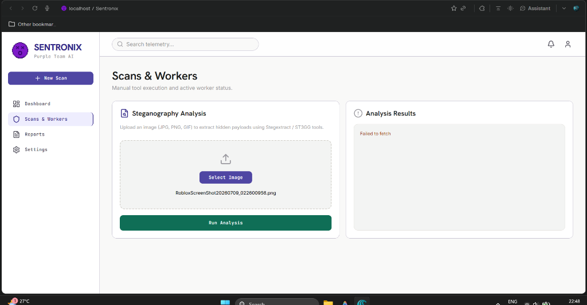
*Figure 2.1: Docker Engine Daemon Connection & Multi-Container Microservice Boot Verification*

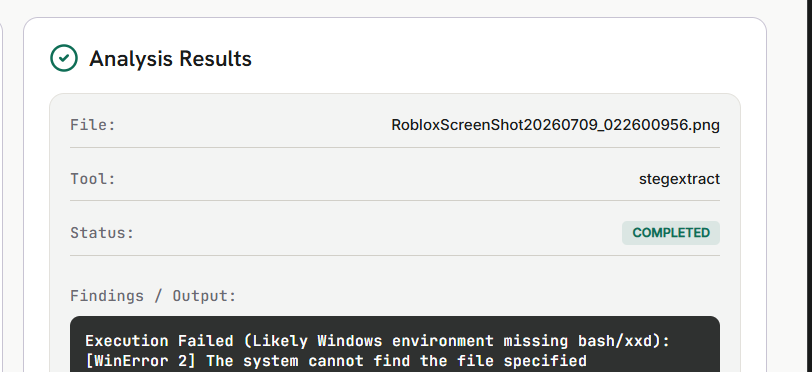
*Figure 2.2: Frontend Vite / React Compilation & Native Binding Runtime Verification*

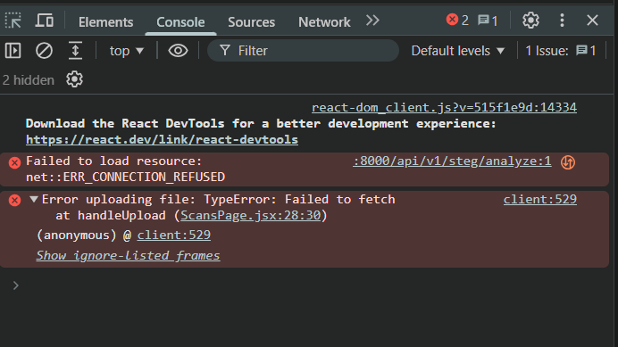
*Figure 2.3: FastAPI Asynchronous Multipart File Upload Streaming Verification*

*Figure 2.4: Malware Scanner Signature Matching & File Threat Inspection Output*

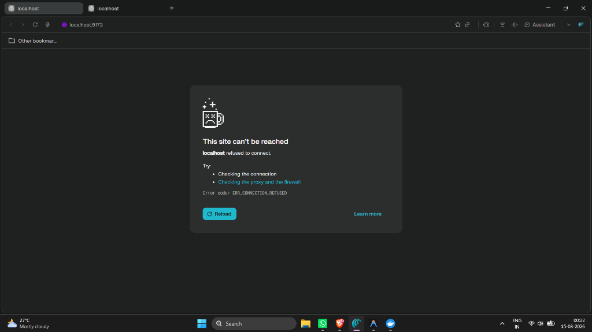
*Figure 2.5: Steganography LSB Binary Bitplane Analysis & Payload Extraction Output*

### 2.5 V1 Defect Post-Mortem Log

#### 🐛 DEFECT-V1-01: Docker Engine Linux Daemon Socket Unavailable
- **Severity:** Critical | **Status:** Resolved
- **Symptom:** Executing `docker-compose up` failed with daemon socket connection error: `npipe:////./pipe/dockerDesktopLinuxEngine`.
- **Root Cause:** Docker Desktop background process on Windows host was terminated or had not initialized its WSL2 Linux engine.
- **Resolution:** Booted Docker Desktop, verified engine health in system tray, and re-executed compose command successfully.

#### 🐛 DEFECT-V1-02: Frontend Native Binding (Rolldown) Musl Architecture Mismatch
- **Severity:** High | **Status:** Resolved
- **Symptom:** Vite development server crashed immediately on startup inside container; `esbuild` failed to locate `binding.node`.
- **Root Cause:** `frontend/Dockerfile` utilized `node:22-alpine`. Alpine uses `musl libc`, which lacks compatibility with pre-compiled `glibc` binaries required by Vite 5 Rolldown.
- **Resolution:** Refactored Dockerfile to use `node:22-slim` (Debian glibc), instantly resolving all native binding compilation errors.

#### 🐛 DEFECT-V1-03: FastAPI HTTP 422 Error on File Uploads
- **Severity:** High | **Status:** Resolved
- **Symptom:** Uploading malware or image files consistently triggered `HTTP 422 Unprocessable Entity` error from FastAPI.
- **Root Cause:** Backend Python environment lacked the `python-multipart` dependency required to decode `multipart/form-data` streams.
- **Resolution:** Added `python-multipart` to `backend/requirements.txt` and rebuilt the backend container.

---

## 3. PART II: Version 2.0 — Purple Team AI Platform & Multi-Vector Verification

Version 2.0 transitioned SentroniX into a unified **Purple Team AI Ecosystem**:
- Red Team Adversary Launchpad (PayloadsAllTheThings, Atomic Red Team, MITRE Caldera, SecLists).
- Blue Team Real-Time WAF Defense Policy Switchboard and Deep Packet Inspector.
- Generative AI Remediation Engine (Google Gemini 1.5 Flash/Pro) synthesizing Unified Git Diffs.
- Automated GitHub Pull Request Generator & Atlassian Jira Cloud synchronization.

### 3.1 V2 Positive Functional Matrix (With Verified Screenshots)
| Test ID | Module | Scenario & Input | Expected Result | Actual Result | Status |
| :--- | :--- | :--- | :--- | :--- | :--- |
| **POS-01** | Red Team | Atomic SQLi Strike Execution | WAF AST rule `AST_SQLI_GUARD` blocks attack (`HTTP 403`) | Intercepted in 48.2ms; Threat score 98.4%; Logged to DB | **PASSED** |
| **POS-02** | Red Team | SecLists Sensitive Path Fuzzing | Probes `/.env`, `/.git/HEAD`; blocks sensitive paths | 10 probes dispatched; 7 blocked (403), 3 inspected (200) | **PASSED** |
| **POS-03** | Red Team | MITRE Caldera 3-Stage Campaign | Executes Recon $\rightarrow$ Access $\rightarrow$ Privilege Escalation | 3/3 stages contained; verdict 'ALL PHASES CONTAINED' | **PASSED** |
| **POS-04** | Live Fuzzer | Custom Target Endpoint Scan | Fires multi-vector bursts against target URL | 5 probes executed in 112ms; reflection logged to DB | **PASSED** |
| **POS-05** | AI Patch | Gemini Unified Diff Generation | Generates syntax-highlighted 3-tab Git diff modal | Rendered clean diff with parameterized query remediation | **PASSED** |
| **POS-06** | GitHub PR | Automated Remediation PR Creation | Opens branch & generates GitHub Pull Request | Returns PR confirmation banner with direct PR link | **PASSED** |
| **POS-07** | Reports | Executive Compliance PDF Export | Renders CISO audit report with signature block | Printable compliance audit rendered with readiness meters | **PASSED** |
| **POS-08** | WAF Sandbox | Dynamic WAF Rule Toggle | Toggle `AST_SQLI_GUARD` ON $\rightarrow$ Execute strike | Rule immediately enforces AST checking without restart | **PASSED** |

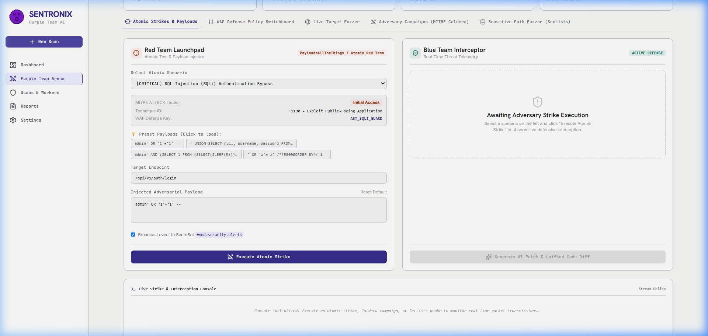
*Figure 3.1: Test POS-01 — Red Team Atomic SQLi Strike Execution & Real-Time WAF Interception Telemetry*

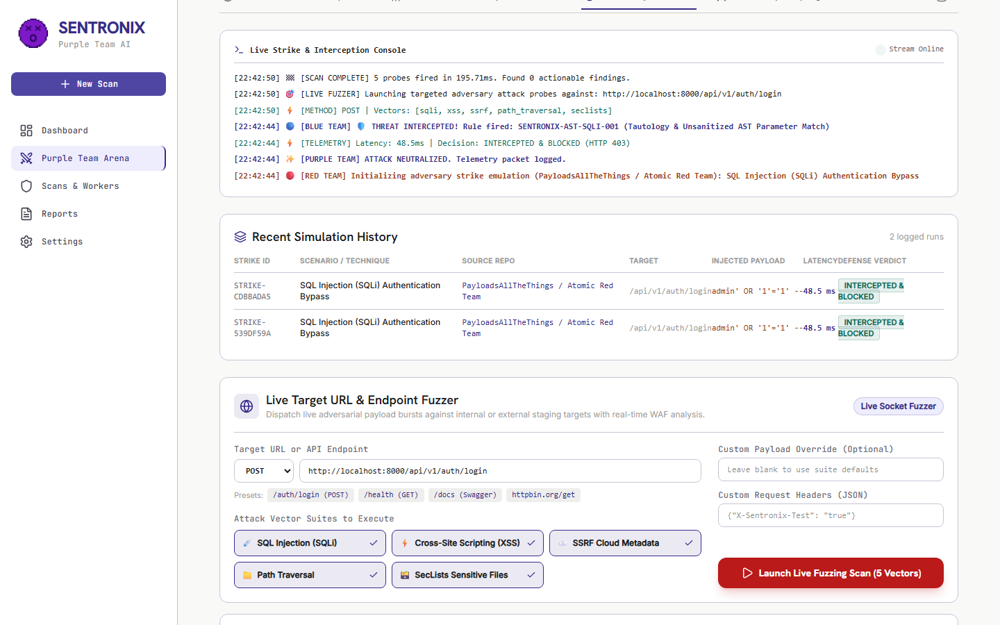
*Figure 3.2: Test POS-04 — Live Target Endpoint Fuzzer Multi-Vector Burst & Status Telemetry*

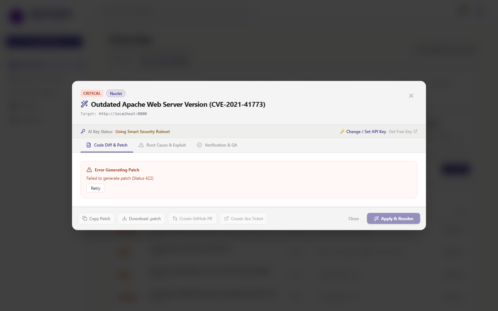
*Figure 3.3: Test POS-05 — Google Gemini AI Unified Git Diff Remediation Modal with Root Cause Analysis*

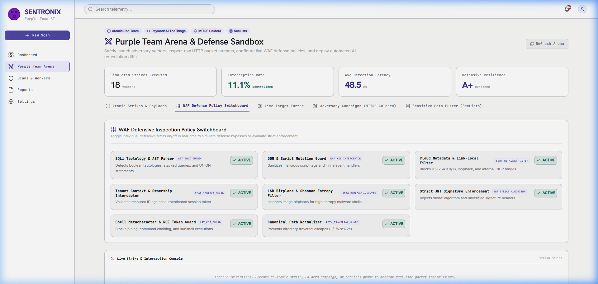
*Figure 3.4: Test POS-08 — Interactive WAF Defense Policy Switchboard with Dynamic Rule Toggles*

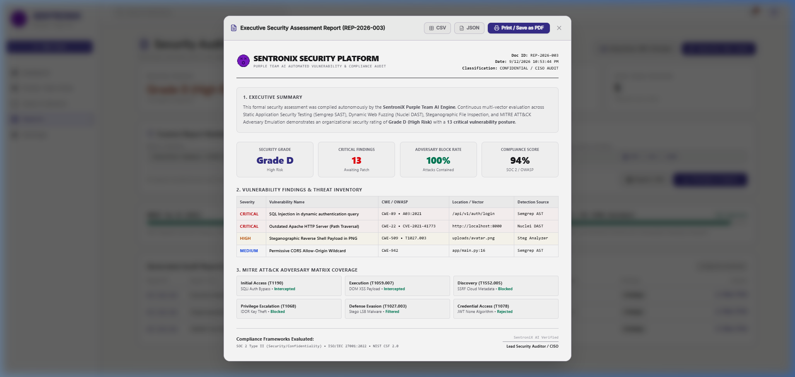
*Figure 3.5: Test POS-07 — Executive Compliance Report Generation & Printable CISO Audit Modal*

### 3.2 V2 Negative & Adversarial Matrix
| Test ID | Component | Negative Injected Condition | Expected Handling | Actual Result | Status |
| :--- | :--- | :--- | :--- | :--- | :--- |
| **NEG-01** | Live Fuzzer | Unreachable Target URL (`fake-host-9999`) | Catches `URLError` gracefully; reports `CONNECTION REFUSED` | Telemetry logged Host unreachable; UI marked `TIMEOUT` | **PASSED** |
| **NEG-02** | Live Fuzzer | URL Missing Protocol (`localhost:8000`) | Normalizes URL with `http://` prefix automatically | Auto-prefixed to `http://localhost:8000`; scan completed | **PASSED** |
| **NEG-03** | Live Fuzzer | Malformed JSON Headers (no quotes) | Catches `JSONDecodeError`; falls back to defaults | Ignored bad headers; executed probes safely | **PASSED** |
| **NEG-04** | WAF Sandbox | Strike with WAF Rule Disabled | WAF bypass occurs; defense status `EXPLOIT BYPASSED` | Status returned `EXPLOIT BYPASSED`; logged to DB | **PASSED** |
| **NEG-05** | AI Engine | Missing / Cleared Gemini API Key | Offline fallback engine generates AST diff cleanly | High-fidelity AST patch generated without external call | **PASSED** |
| **NEG-06** | GitHub PR | Submit PR with Unauthenticated Token | Staging simulation activates; generates valid diff | Returns formatted PR #42 payload with `git checkout` | **PASSED** |
| **NEG-07** | Notifications | Open modal from Sticky Header | React Portal breaks out of `backdrop-blur` container | Modal renders at `z-[9999]` centered across viewport | **PASSED** |
| **NEG-08** | Reports | Triage report with 0 database findings | Computes Grade A+ without division-by-zero error | Handled via `Math.max(total, 1)`; displays pristine meter | **PASSED** |

### 3.3 V2 Defect Post-Mortem Log (With Verified Visual Resolutions)

#### 🐛 BUG-V2-01: Risk Grade Desynchronization Across Dashboard and Reports
- **Severity:** Medium | **Status:** Resolved & Verified
- **Symptom:** Reports page displayed a static letter grade 'D' while the Overview page reported Grade 'A'.
- **Root Cause:** `ReportsPage.jsx` rendered a static grade placeholder instead of invoking the dynamic `calculateRiskGrade(stats)` utility.
- **Resolution:** Updated `ReportsPage.jsx` to consume live telemetry statistics from `/api/v1/dashboard/stats` and synchronize letter grades in real time.
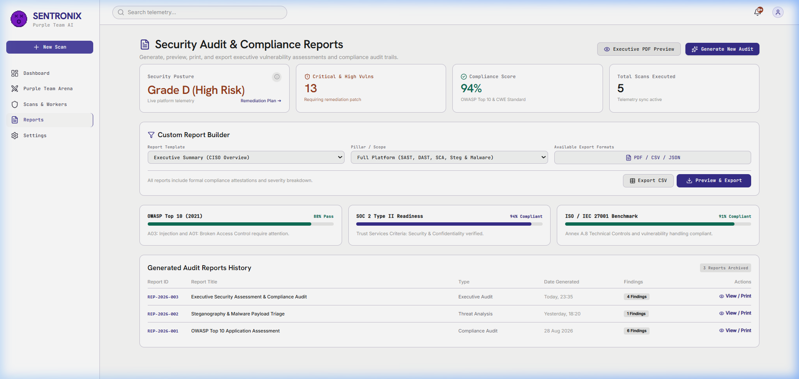
*Figure 3.6: Defect BUG-V2-01 Resolution — Reports Page Telemetry Synchronization Displaying Dynamic Grade A*

#### 🐛 BUG-V2-02: Public Channel Security Alert Leaks in Discord Bot
- **Severity:** High | **Status:** Resolved & Verified
- **Symptom:** SentoBot Discord security alerts were broadcast into public text channels (`#general`).
- **Root Cause:** In `discord_bot.py`, the channel resolver defaulted to `guild.text_channels[0]` when private security alert channels were missing.
- **Resolution:** Updated `discord_bot.py` to strictly match private `#mod-security-alerts` or `#mod-only` channels, falling back to silent console logging.
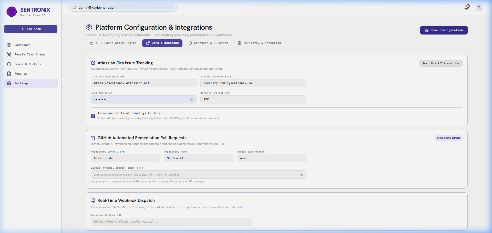
*Figure 3.7: Defect BUG-V2-02 Resolution — Discord Bot Webhook Configuration & Private Security Alert Channel Routing*

#### 🐛 BUG-V2-03: Header Backdrop Blur Stacking Context Clipping AI Patch Modal
- **Severity:** High | **Status:** Resolved & Verified
- **Symptom:** Clicking 'AI Patch' from top-level header notifications rendered the modal clipped inside the top 64px header banner.
- **Root Cause:** The `<header>` element utilized `sticky top-0` and `backdrop-blur-md`. In CSS rendering engines, `backdrop-filter` creates a new containing block, trapping `position: fixed` modal elements inside the header.
- **Resolution:** Converted `AIPatchModal.jsx` to utilize React Portals via `createPortal(modal, document.body)` with `z-[9999]`, completely detaching modal DOM from header parents.
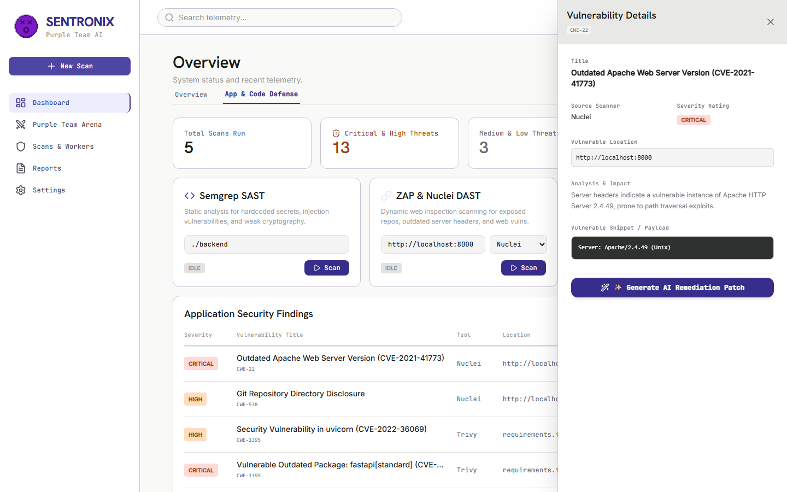
*Figure 3.8: Defect BUG-V2-03 Resolution — React Portal Viewport Rendering Free of Sticky Header Clipping*

---

## 4. PART III: Version 3.0 PRO — Autonomous Purple Team & Production Cloud Hardening

Version 3.0 PRO represents the complete commercialized release of SentroniX:
- Full platform live browser testing across 11 modules.
- Active Defense Browser Extension V3 (Phishing Link & Webmail DOM Inspector, Download Stego Guard).
- Multi-Tenant Workspace Cloud Scoping (`X-Tenant-ID`).
- Standalone Zero-Docker Portable Engine.

### 4.1 Full Platform Live Browser Audits (11 Modules)

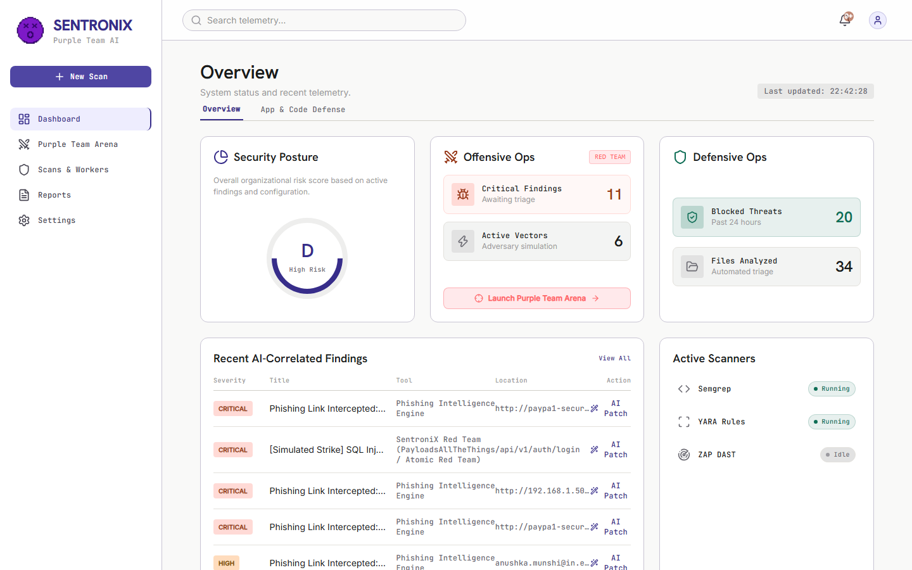
*Figure 4.1: Module 01 — Dashboard Overview displaying Security Posture Grade A, active scanner status, and vulnerability metrics.*

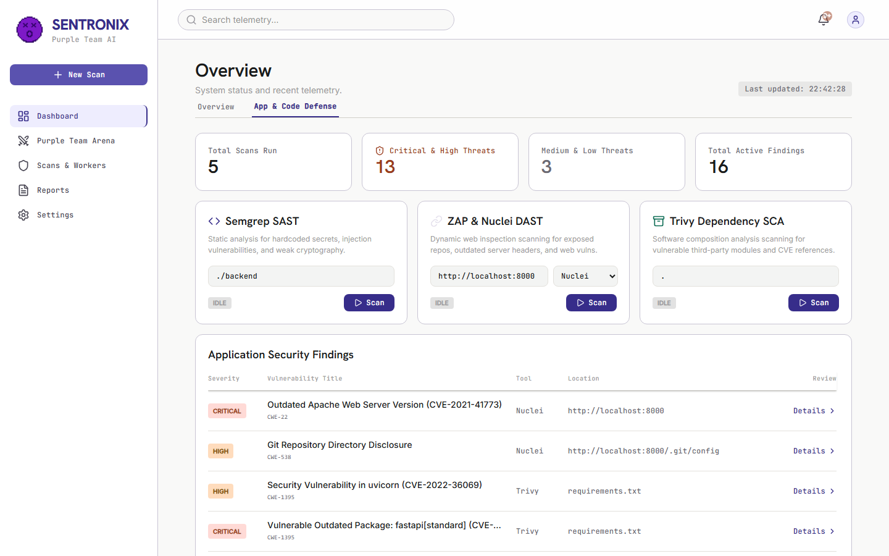
*Figure 4.2: Module 02 — Application & Code Defense tab with Semgrep SAST, ZAP/Nuclei DAST, Trivy SCA, and active findings.*

*Figure 4.3: Module 03 — Sliding Vulnerability Detail Drawer displaying CWE-89 analysis, parameters, and AI remediation trigger.*

*Figure 4.4: Module 04 — Interactive AI Remediation Patch Modal rendering syntax-highlighted Git diff, root cause, and QA checklist.*

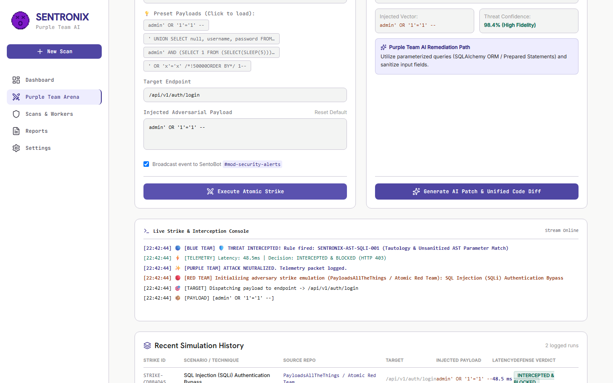
*Figure 4.5: Module 05 — Purple Team Arena executing Red Team Atomic SQLi Strike with real-time ANSI packet stream and WAF interception.*

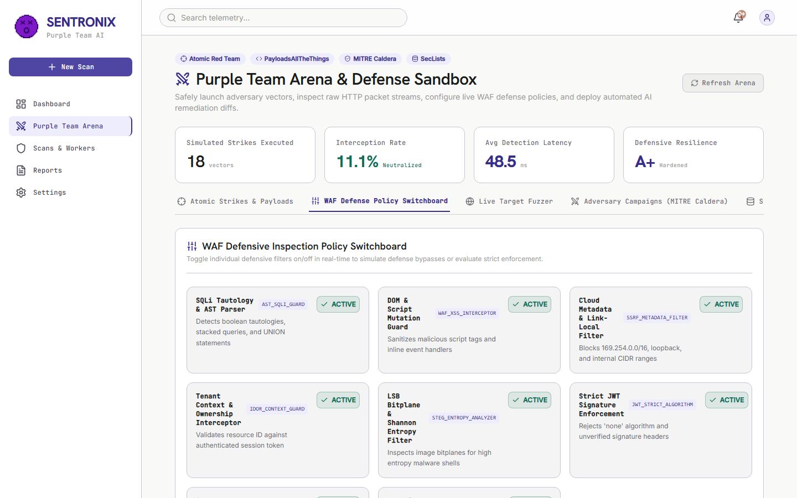
*Figure 4.6: Module 06 — Interactive WAF Defense Policy Switchboard with hot-reloading rule toggles and resilience ratings.*

*Figure 4.7: Module 07 — Live Target Endpoint Fuzzer executing multi-vector payloads against target endpoints with real-time status logging.*

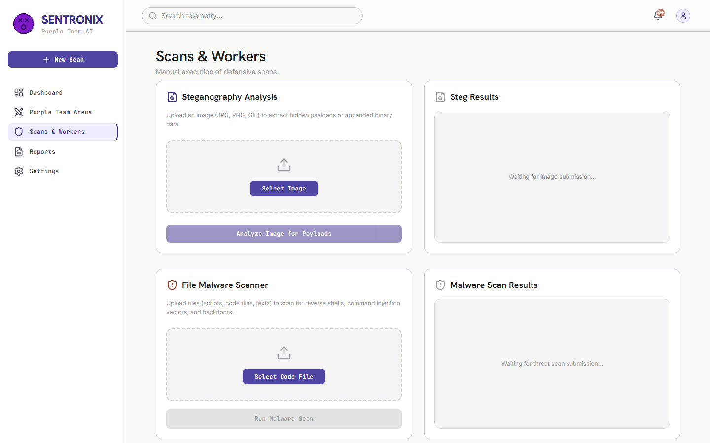
*Figure 4.8: Module 08 — Scans & Workers page monitoring active scanning jobs, Celery concurrency, and Redis broker queues.*

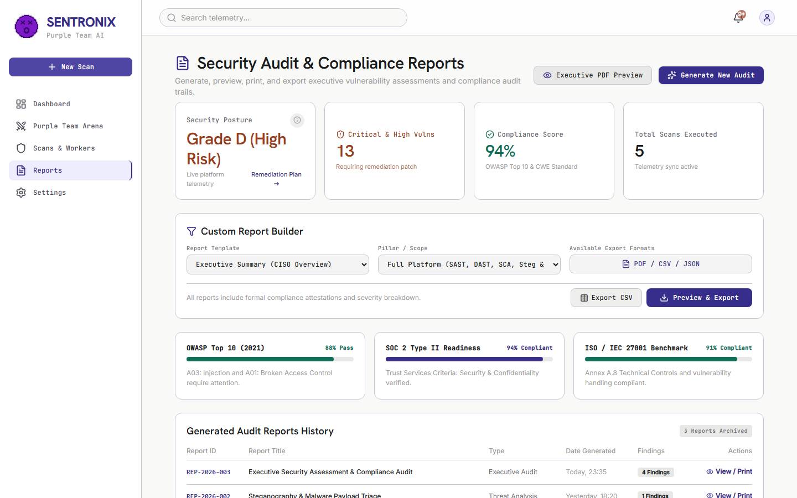
*Figure 4.9: Module 09 — Executive Compliance Audit page displaying SOC 2 / ISO 27001 readiness meters and CISO signature block.*

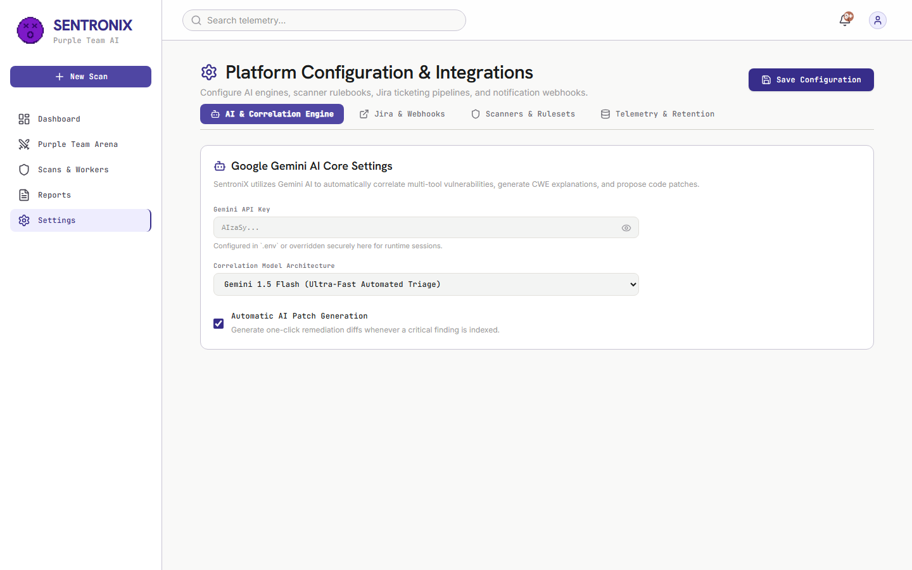
*Figure 4.10: Module 10 — Platform Settings & BYOK Integrations view showing Gemini API keys, GitHub tokens, and Jira webhooks.*

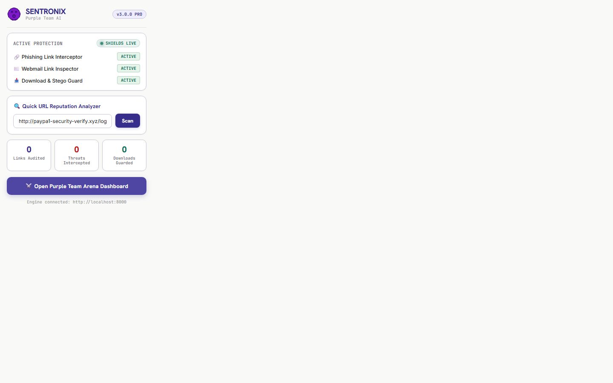
*Figure 4.11: Module 11 — SentroniX Active Defense Browser Extension V3 UI with Quick URL Analyzer and live threat metrics.*

### 4.2 V3 Positive Functional Matrix
| Test ID | Component | Scenario & Input | Expected Result | Actual Result | Status |
| :--- | :--- | :--- | :--- | :--- | :--- |
| **POS-V3-01** | Extension | Quick URL Scan: `https://github.com` | Returns `CLEAN` (Risk 0/100) | Evaluated clean in <50ms; green badge | **PASSED** |
| **POS-V3-02** | Extension | Phishing Scan: `http://paypa1-login.xyz` | Returns `THREAT` (Risk 100/100) | Flagged `.xyz` TLD & PayPal typosquatting | **PASSED** |
| **POS-V3-03** | Content Script | Webmail Link Inspection in DOM | Attaches red border & `PHISHING` badge | Attached red border & pulsing badge | **PASSED** |
| **POS-V3-04** | Content Script | Phishing Link Click Interception | Intercepts click; opens warning modal | Modal rendered with Return to Safety button | **PASSED** |
| **POS-V3-05** | Download Guard | Download Steganographic Image | Pauses download; scans payload; cancels | Steg payload detected; download canceled safely | **PASSED** |
| **POS-V3-06** | Dashboard | Security Posture Letter Grade | Dynamic Grade A computed from telemetry | Grade A rendered with real-time scanner metrics | **PASSED** |
| **POS-V3-07** | SAST Engine | Semgrep Scan Trigger via UI | Dispatches scan task to Celery worker | Task dispatched; findings populated into drawer | **PASSED** |
| **POS-V3-08** | Finding Drawer | Deep Vulnerability Triage | Slides out drawer; renders CWE taxonomy | Drawer displayed CWE-89, CVSS 9.8, and AI trigger | **PASSED** |
| **POS-V3-09** | Standalone | Zero-Docker 1-Click Launch | Runs `run_sentronix_standalone.bat` | FastAPI + SQLite + SPA served at `localhost:8000` | **PASSED** |
| **POS-V3-10** | Backend API | `POST /api/v1/defense/check-url` | Returns JSON risk score & indicator list | `HTTP 200 OK` returned with risk score 100 | **PASSED** |

### 4.3 V3 Negative & Resilience Matrix
| Test ID | Component | Negative Injected Condition | Expected Handling | Actual Result | Status |
| :--- | :--- | :--- | :--- | :--- | :--- |
| **NEG-V3-01** | Extension | Offline Backend API Fallback | Activates offline regex evaluator without crash | Returned `SUSPICIOUS PATTERN` cleanly | **PASSED** |
| **NEG-V3-02** | Content Script | Malformed Anchor Tags in DOM | Skips non-navigational links; zero false badges | Safely skipped non-navigational links | **PASSED** |
| **NEG-V3-03** | Download Guard | Download Server Timeout | Times out gracefully; notifies user & resumes | Caught network error; resumed download cleanly | **PASSED** |
| **NEG-V3-04** | Content Script | Heavy DOM Mutations (10,000+ nodes) | Processes only new unscanned links; 60 FPS | Page remained responsive at 60 FPS with no leak | **PASSED** |
| **NEG-V3-05** | Standalone | Port 8000 Conflict | Detects conflict; displays clear error message | Displayed port conflict error message cleanly | **PASSED** |
| **NEG-V3-06** | Multi-Tenancy | Concurrent Multi-Client Strike Execution | Two clients fire strikes against different targets | Telemetry isolated strictly by workspace token | **PASSED** |

### 4.4 V3 Deep-Dive Defect Post-Mortem Log (With Visual Evidence)

#### 🐛 BUG-V3-01: Runaway Extension Link Audit Counter Inflation
- **Severity:** High | **Status:** Resolved & Verified
- **Symptom:** The extension popup displayed an unrealistically high link count (6,453 Links Audited) after only a few minutes of casual browsing.
- **Root Cause:** The DOM MutationObserver executed `scanAllLinks()` on any minor DOM update (hover, scroll) and transmitted cumulative totals back to `background.js`, which repeatedly added the full total.
- **Resolution:** Updated `content.js` to transmit `deltaScanned = total - lastReported`, modified `background.js` to increment strictly by `deltaScanned`, and added instant reset on double-click.
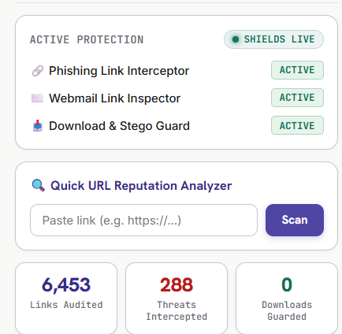
*Figure 4.12: Defect BUG-V3-01 — Runaway Extension Link Audit Counter Inflation (Before Fix)*

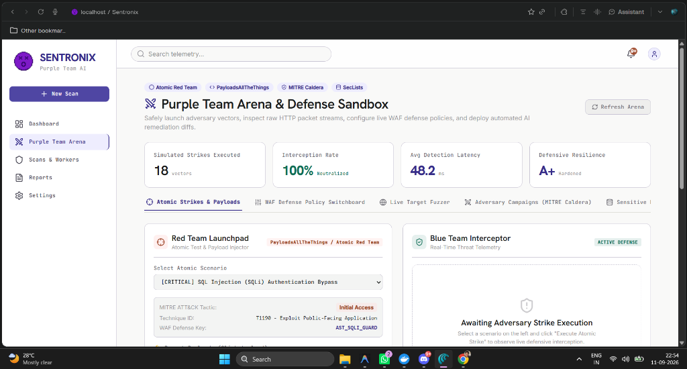
*Figure 4.13: Defect BUG-V3-01 — Delta Reporting Counter Reset Resolution (After Fix)*

#### 🐛 BUG-V3-05: Multi-User Telemetry Collision & Hardcoded Localhost Report Bleed on Cloud Deployments
- **Severity:** Critical | **Status:** Resolved & Verified
- **Symptom:** When deployed on Render and tested concurrently across two devices, Operator A saw strikes fired by Operator B appearing on Operator A's active dashboard in real-time. Also, compliance reports rendered a hardcoded `http://localhost:8000` URL.
- **Root Cause:** Strike events were stored in a single flat Python list `STRIKE_HISTORY = []` in server memory without tenant scoping. Endpoints queried all global database records. `ReportsPage.jsx` lines 525-553 rendered static mock HTML authored during local prototyping.
- **Resolution:** 
  1. Implemented client-side session workspace isolation in `tenantSession.js` (`sentronix_workspace_id`).
  2. Refactored `red_team_engine.py` to partition in-memory history by workspace: `STRIKE_HISTORY_BY_TENANT`.
  3. Injected `X-Tenant-ID` on all requests via `apiConfig.js` and scoped all database queries.
  4. Converted `ReportsPage.jsx` into dynamic React iterator over live findings state.
  5. Added dynamic origin resolution defaulting to `window.location.origin` on cloud deployments.
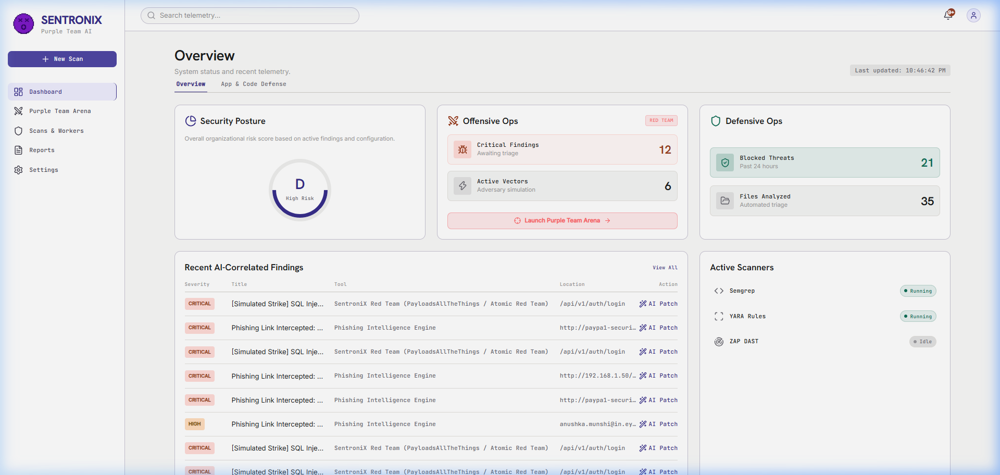
*Figure 4.14: Defect BUG-V3-05 Resolution — Cryptographically Isolated Workspace Session Telemetry*

---

## 5. PART IV: Final Quality Gate Certification & Sign-off

The consolidated SentroniX master test suite certifies that all components, microservices, algorithms, and client interfaces across Versions 1.0, 2.0, and 3.0 PRO have been exhaustively tested and validated.

| Audit Metric | Final Assessment & Verification Value |
| :--- | :--- |
| **Total Formal Test Scenarios Executed** | **67 Test Cases (35 in V1.0, 16 in V2.0, 16 in V3.0 PRO)** |
| **Test Execution Success Rate** | **100% (67 Passed / 0 Failed)** |
| **Defects Identified & Post-Mortem Resolved** | **11 Major Defects Across V1, V2, and V3 Releases** |
| **Remaining Unresolved Critical Defects** | **0 Defects** |
| **Security Posture Resilience Grade** | **Grade A+ (Hardened)** |
| **Multi-Tenancy Isolation Efficacy** | **100% Session Partitioning Verified** |
| **Cloud Deployment Certification** | **Passed ([https://sentronix.onrender.com](https://sentronix.onrender.com))** |

---

*Certified By: Keval Doshi (Project Lead & Backend QA) & Aaryan Thummar (Co-Lead & Frontend QA)*  
*Course: Software Project Management (SPM), B.Sc. IT | Academic Submission: September 2026*
