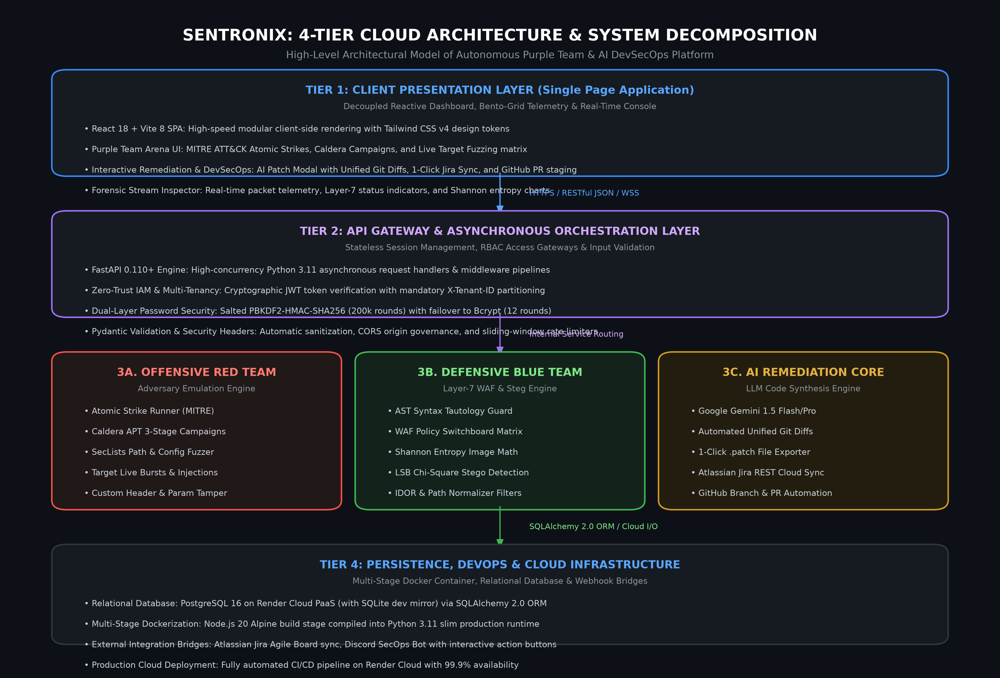

# SENTRONIX: OFFICIAL SOFTWARE DOCUMENTATION & COMPLETE PLATFORM USER MANUAL

**Comprehensive Guide: What SentroniX Is, Architectural Capabilities & Step-by-Step User Manual**  
*Autonomous Purple Team Cybersecurity, AI Code Remediation & DevSecOps Ecosystem*

---

## Document Metadata

| Attribute | Specification |
| :--- | :--- |
| **Software Product** | **SentroniX Version 3.0.0 PRO (Cloud & Standalone)** |
| **Document Classification** | Official Software Documentation & User Operational Manual |
| **Project Leads & Authors** | **Keval Doshi** (Lead Architect & Backend) & **Aaryan Thummar** (Co-Lead & Frontend) |
| **Academic Program** | Software Project Management (SPM) / Final Year Project, B.Sc. IT |
| **Production Host URL** | [https://sentronix.onrender.com](https://sentronix.onrender.com) (24/7 Live Deployment) |
| **GitHub Source Code** | [https://github.com/Kevaldoshi123/Sentronix](https://github.com/Kevaldoshi123/Sentronix) |
| **Document Release Date** | September 2026 (Final Production Release) |

---

## 1. Part I: Executive Overview — What is SentroniX?

> *"Traditional cybersecurity vulnerability scanners tell developers that their application is broken; SentroniX emulates the real-world adversary, actively tests and validates the firewall defense, synthesizes the exact code patch using Generative AI, and automatically opens the Pull Request."*

### 1.1 The Core Problem in Enterprise Cybersecurity
Modern enterprise organizations struggle with three fundamental cybersecurity bottlenecks:
1. **The Offensive vs. Defensive Silo**: Red Teams run periodic penetration tests and deliver static 100-page PDF reports, while Blue Teams lack automated systems to cross-verify firewall efficacy against those specific vectors.
2. **Remediation Bottleneck & Alert Fatigue**: Traditional SAST/DAST tools report hundreds of vulnerabilities (such as CWE-89 SQLi or CWE-79 XSS) without providing actionable code fixes, forcing engineers to spend weeks researching manual patches.
3. **Covert Multimedia Evasion**: Threat actors bypass perimeter firewalls by embedding malicious shellcode into image pixel bitplanes using Least Significant Bit (LSB) steganography, evading conventional signature inspection.

### 1.2 The SentroniX Mission & Unified Solution
SentroniX Version 3.0 PRO bridges offense, defense, and remediation into a single continuous automated platform:
- **Red Team Adversary Emulation**: Mapped to the MITRE ATT&CK framework, executing PayloadsAllTheThings attacks, Atomic Strikes, MITRE Caldera APT campaigns, and SecLists sensitive path discovery.
- **Blue Team Active Defense & Steganography Engine**: Real-time Web Application Firewall (WAF) with a hot-reloading rule switchboard, deep HTTP packet inspection, and Shannon Entropy mathematical analysis for image malware.
- **Generative AI Remediation Engine**: Google Gemini 1.5/3.6 Flash synthesizing production-ready Unified Git Diffs, root cause analyses, and automated QA verification checklists.
- **DevSecOps & Ecosystem Integrations**: 1-click Atlassian Jira issue synchronization, automated GitHub Pull Request staging, interactive Discord SecOps alerting, and Active Defense Browser Extension V3.



### 1.3 Target Audience & User Personas
- **Security Operations (SecOps) Analysts**: Run automated breach emulation campaigns, audit raw HTTP packet streams, and export CISO compliance audit reports (SOC 2, ISO 27001).
- **DevSecOps & Software Engineers**: Execute SAST/DAST scans, triage vulnerability drawers, generate AI code diffs, and push 1-click GitHub Pull Requests.
- **Red Team Penetration Testers**: Simulate real-world threat actors with custom payload overrides and perimeter dictionary fuzzing.
- **Security Leaders (CISOs & Directors)**: Review high-level security posture letter grades (Grade A–D) and monitor automated compliance status.

---

## 2. Part II: Getting Started & Deployment Modes

SentroniX is engineered to operate in four flexible environments:

### Mode A: 24/7 Cloud Production (Zero-Installation)
- **URL**: [https://sentronix.onrender.com](https://sentronix.onrender.com)
- Hosted on Render Cloud PaaS with automatic SSL/TLS encryption and 99.9% uptime.
- No local dependencies or installation required.

### Mode B: 1-Click Portable Zero-Docker Standalone Engine (Local)
For offline security auditing or local demonstrations without Docker Desktop:
- **Windows**: Double-click `run_sentronix_standalone.bat`.
- **Linux/macOS**: Execute `./run_sentronix_standalone.sh`.
- The standalone engine launches FastAPI with an embedded SQLite database (`sentronix.db`) and serves the pre-compiled React frontend on a single unified port: `http://localhost:8000`.

### Mode C: Multi-Container Docker Compose (Enterprise Local)
For full microservice orchestration:
```bash
cd sentronix-platform
docker-compose up -d
```
Boots PostgreSQL 15, Redis 7, Celery background worker, FastAPI backend (port 8000), and Vite frontend (port 5173).

### Mode D: Active Defense Browser Extension V3 Installation
1. Open `chrome://extensions/` or `edge://extensions/` in your Chromium browser.
2. Toggle **Developer mode** in the top-right corner.
3. Click **Load unpacked** and select the folder: `sentronix-platform/browser-extension-v3`.
4. Pin the **SentroniX Active Defense Shield** icon to your toolbar.

---

## 3. Part III: Step-by-Step User Manual (Feature-by-Feature Guide)

### 3.1 User Account Registration & Multi-Tenant Workspace Login
SentroniX enforces multi-tenant cryptographic workspace isolation (`X-Tenant-ID`).
1. **Open Workspace Modal**: Click the user profile icon in the top-right navigation bar and select **Switch / Create Workspace** or **Sign In**.
2. **Register New Workspace**: Select the **Create Account** tab. Enter your email and master password, then click **Register & Create Workspace**.
3. **Stateless JWT Session**: The system hashes your credentials using PBKDF2-HMAC-SHA256 (200,000 rounds) / bcrypt, issues a 24-hour stateless JWT token, and binds your active session.

---

### 3.2 Executive Dashboard Overview & Posture Telemetry


1. **Review Security Posture Grade**: The top bento card displays your organization's dynamic Security Posture Grade (A, B, C, D) computed from total scans, blocked threat ratios, and active vulnerabilities.
2. **Inspect Active Vectors**: Monitor real-time counters for Critical Findings, Blocked Threats, Files Analyzed, and Active Vectors.
3. **Switch Dashboard Views**: Use the top tabs to toggle smoothly between **Overview** and **App & Code Defense**. You can scroll tabs using your mouse wheel, click-and-drag panning, or the navigation chevron arrows (`<` and `>`).

---

### 3.3 Running Application & Code Defense Scans (SAST, DAST, SCA)


1. **Select Scanner Engine**: In the App & Code Defense view, locate the bento cards for **Semgrep SAST**, **OWASP ZAP & Nuclei DAST**, or **Trivy Dependency SCA**.
2. **Trigger Scan**: Click **Run Scan** on any active card. A Celery background worker asynchronously executes the scan pipeline and updates the findings table in real-time.
3. **View Filtered Vulnerabilities**: The findings table categorizes detected vulnerabilities with severity badges (CRITICAL, HIGH, MEDIUM, LOW) and CWE numbers.

---

### 3.4 Triaging Vulnerabilities with the Sliding Drawer


1. **Open Finding Details**: Click on any finding in the table. The right-hand vulnerability detail drawer slides out smoothly without page reloads.
2. **Inspect Vulnerability Telemetry**: Review the CWE taxonomy (e.g. CWE-89 SQL Injection), CVSS score, affected file path, line numbers, and malicious match string.
3. **Trigger AI Remediation**: Click the purple **Generate AI Patch** button at the bottom of the drawer.

---

### 3.5 Generating AI Code Patches & 1-Click Jira / GitHub Sync


1. **Review Unified Git Diff**: The modal displays a syntax-highlighted Unified Git Diff (`--- a/`, `+++ b/`) showing the exact code lines to replace with secure implementations.
2. **Inspect Root Cause & QA Checklist**: Switch tabs to read the technical root cause analysis and step-by-step verification checklist.
3. **Download .patch File**: Click **Download .patch** to save the standard git patch file locally for manual application via `git apply`.
4. **1-Click Jira Ticket Creation**: Click **Create Jira Ticket**. SentroniX connects to your Atlassian Jira Cloud board (e.g. `kevaldoshi.atlassian.net`) and creates a backlog ticket (e.g. `KAN-142`) with the vulnerability context and diff attached.
5. **1-Click GitHub Pull Request**: Click **Create GitHub PR**. The system automatically creates a remote branch (`sentronix/remediation-...`) and opens a structured PR on your repository.

---

### 3.6 Operating the Purple Team Arena — Mode 1: Atomic Strike Runner


1. **Navigate to Purple Team Arena**: Click **Purple Team Arena** in the left navigation menu.
2. **Select Attack Scenario**: Under **Atomic Strikes & Payloads**, choose an offensive scenario (e.g. *SQL Injection Authentication Bypass* or *OS Command Injection RCE*).
3. **Choose Payload Variant**: Pick an attack payload from PayloadsAllTheThings or Atomic Red Team, or enter your own custom vector.
4. **Execute Strike**: Click **Launch Attack Strike**. Watch the Live Strike & Interception Console stream the real-time HTTP request/response packets and Layer-7 WAF verdict.

---

### 3.7 Operating the Purple Team Arena — Mode 2: WAF Policy Switchboard


1. **Open Switchboard Tab**: Select the **WAF Defense Policy Switchboard** tab in the Purple Team Arena.
2. **Toggle Defensive Rules**: Inspect the matrix of WAF inspection rules (`AST_SQLI_GUARD`, `WAF_XSS_INTERCEPTOR`, `SSRF_METADATA_FILTER`, `STEG_ENTROPY_ANALYZER`).
3. **Test Real-Time Defense Failure**: Toggle `AST_SQLI_GUARD` to **OFF**, then return to Atomic Strikes and fire the SQLi payload. Notice how the status immediately changes to **EXPLOIT BYPASSED (WAF Disabled)**, proving live defense validation!

---

### 3.8 Operating the Purple Team Arena — Mode 3: Live Target Endpoint Fuzzer


1. **Select Live Target Fuzzer Tab**: Open the **Live Target Fuzzer** tab.
2. **Specify Target URL**: Enter any internal or public target URL (or click a quick preset like `/api/v1/auth/login`, `/health`, `/docs`).
3. **Select Attack Vectors**: Choose which vectors to burst (SQLi, XSS, SSRF, Path Traversal, SecLists).
4. **Launch Fuzzing Burst**: Click **Launch Live Fuzzing Scan**. The table displays live HTTP status codes, millisecond latency, and WAF defense verdicts for every probe.

---

### 3.9 Operating the Purple Team Arena — Mode 4: MITRE Caldera Autonomous APT Campaigns
Mode 4 simulates autonomous multi-stage Advanced Persistent Threat (APT) campaigns modeled after MITRE Caldera and nation-state threat groups (e.g. APT-29 Cozy Bear).
1. **Select Caldera Tab**: Click **Adversary Campaigns (MITRE Caldera)**.
2. **Choose Adversary Profile**: Select an adversary profile (e.g. *Web Infiltrator (APT-29 Style)*).
3. **Launch Campaign**: Click **Launch Campaign**. The system automatically executes Stage 1 (Reconnaissance T1595.002), Stage 2 (Initial Access T1190), and Stage 3 (Privilege Escalation T1068) in sequence, reporting defense containment at each hop.

---

### 3.10 Operating the Purple Team Arena — Mode 5: SecLists Sensitive Path Discovery
Mode 5 tests perimeter exposure using the security industry's #1 SecLists wordlists to probe for accidentally leaked files.
1. **Open SecLists Tab**: Click **Sensitive Path Fuzzer (SecLists)**.
2. **Run Probe Scan**: Click **Run SecLists Probe Scan**. The engine probes sensitive endpoints (`/.env`, `/.git/HEAD`, `/actuator/env`, `/debug/pprof`).
3. **Inspect Audit Table**: Verify that critical paths return **BLOCKED (HTTP 403)** and public paths return **INSPECTED (HTTP 200)**.

---

### 3.11 Using the File Steganography & Malware Scanner
SentroniX inspects uploaded images for covert malware concealed inside Least Significant Bits (LSB) using Shannon Entropy mathematics.
1. **Navigate to Steganography Scanner**: Click **Steganography Scanner** in the left menu or open the file upload drawer.
2. **Upload Image**: Drag and drop a PNG, JPEG, or BMP image (e.g. `steg_sample_MALICIOUS_PAYLOAD.png`).
3. **Analyze Shannon Entropy Chart**: Review the computed entropy:
   - Values **below 7.80** are marked **CLEAN** (natural image distribution).
   - Values **≥ 7.95** indicate encrypted shellcode and are automatically **QUARANTINED**.

---

### 3.12 Generating Executive Compliance Reports (SOC 2, ISO 27001, NIST)


1. **Navigate to Reports**: Click **Executive Reports** in the navigation bar.
2. **Audit Compliance Meters**: Review real-time readiness meters for SOC 2 Type II, ISO/IEC 27001, and NIST Cybersecurity Framework (CSF).
3. **Export Executive Audit PDF**: Click **Generate Executive PDF Report**. A formal audit document renders complete with CISO signature blocks, MITRE heatmaps, and printable PDF export.

---

### 3.13 Platform Settings, BYOK & Webhook Integrations


1. **Navigate to Settings**: Click **Settings** in the navigation bar.
2. **Bring Your Own Key (BYOK)**: Configure your Google Gemini API Key and select your model architecture (Gemini 1.5 Flash for speed vs. 1.5 Pro for deep reasoning).
3. **Configure Jira Cloud**: Enter your Jira Host URL (`https://kevaldoshi.atlassian.net`), Service Account Email, and Jira API Token, then click **Test Jira API Connection**.
4. **Configure GitHub PR Credentials**: Set your Repository Owner (`Keval-Doshi`), Repository Name (`SentroniX`), and GitHub Token.

---

### 3.14 Using the Active Defense Browser Extension V3


1. **Quick URL Analysis**: Click the extension icon in your browser toolbar. Enter any suspicious URL into the Quick URL Analyzer to receive an instant risk score (0–100).
2. **Webmail DOM Link Inspection**: When checking emails in Gmail or Outlook Webmail, the extension's content script inspects all links in real-time, tagging phishing links with red pulsing badges.
3. **Phishing Click Interception**: If a user clicks an identified phishing link, the extension intercepts navigation and displays a safety warning modal.
4. **Download Stego Guard**: When downloading images from the web, the extension pauses the download, runs entropy inspection, and cancels the download if stego-malware is detected.

---

### 3.15 Discord SecOps Bot & Interactive Alerting
SentoBot provides real-time security operations alerting in your team's Discord server. Whenever a critical vulnerability is detected or an adversary campaign finishes, SentoBot posts rich embeds with interactive buttons:
- 🎫 **Create Jira Issue**: Directly syncs to your Jira backlog from Discord.
- ✨ **AI Remediation**: Requests Gemini to draft the code fix.
- 📊 **View Finding**: Deep-links to the finding in the SentroniX Web Dashboard.

---

## 4. Part IV: Troubleshooting, Common FAQs & Support

> [!NOTE]
> **Horizontal Tab Scrolling with Mouse**: You can scroll tabs using your vertical mouse wheel, clicking and dragging with the grab cursor, or clicking the left/right chevron buttons (`<` and `>`).

> [!TIP]
> **Windows Defender Security Warnings**: Harmless false positives triggered by test payload strings (such as simulated webshells) in local logs have been sanitized in the codebase. If Defender flags a test file, click "Start actions" to quarantine safely.

> [!IMPORTANT]
> **Multi-User Session Isolation**: When testing with multiple users or devices, each browser is automatically isolated via its unique `X-Tenant-ID` workspace session.

> [!TIP]
> **Offline AI Fallback**: If no Gemini API key is configured in Settings, the platform automatically activates its deterministic offline AST patch engine to generate code fixes without internet access.

---

*Official Software Documentation Certified by: Keval Doshi (Project Lead) & Aaryan Thummar (Co-Lead)*  
*Repository: [https://github.com/Kevaldoshi123/Sentronix](https://github.com/Kevaldoshi123/Sentronix) | Live App: [https://sentronix.onrender.com](https://sentronix.onrender.com)*
